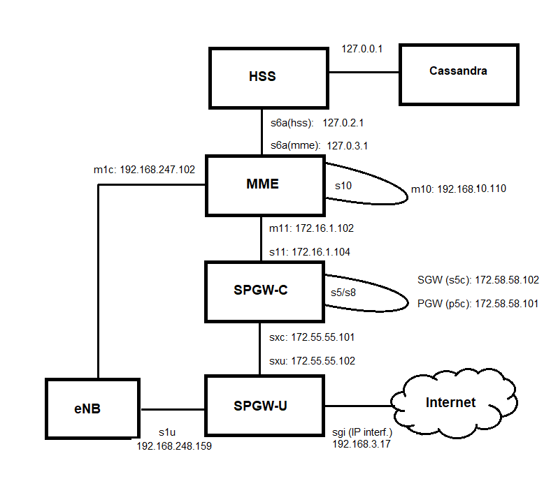

# OpenAir

Before Installing the Core Network
===================================

Before we install the core network, we need to properly setup our virtualbox. This will consist of fixing the FQDN, setting up the virtual networking, installing the proper kernel for the SPGW, and downloading the latest version of the core network from the github repo.

## Specify the FQDN

    sudo nano /etc/hosts

Make it look like this:

    127.0.0.1   localhost
    127.0.1.1   mme.OpenAir5G.Alliance   mme
    127.0.1.1   hss.OpenAir5G.Alliance   hss

## Setup network

Run ifconfig and look at the output. Mine looks like:

    ens33: flags=4163<UP,BROADCAST,RUNNING,MULTICAST>  mtu 1500
            inet 192.168.1.102  netmask 255.255.255.0  broadcast 192.168.1.255
            ether 08:00:27💿3c:98  txqueuelen 1000  (Ethernet)
            RX packets 782048  bytes 550640279 (550.6 MB)
            RX errors 0  dropped 0  overruns 0  frame 0
            TX packets 387804  bytes 37041353 (37.0 MB)
            TX errors 0  dropped 0 overruns 0  carrier 0  collisions 0

    lo: flags=73<UP,LOOPBACK,RUNNING>  mtu 65536
            inet 127.0.0.1  netmask 255.0.0.0
            loop  txqueuelen 1000  (Local Loopback)
            RX packets 426942  bytes 35904185 (35.9 MB)
            RX errors 0  dropped 0  overruns 0  frame 0
            TX packets 426942  bytes 35904185 (35.9 MB)
            TX errors 0  dropped 0 overruns 0  carrier 0  collisions 0

We need to add a few virtual things. Here’s the commands I use:

    sudo ifconfig ens33:0 172.66.1.113 up  # For the HSS side of S6a
    sudo ifconfig ens33:11 172.66.1.111 up # For the MME side of S6a

After this, my ifconfig looks like:

    ens33: flags=4163<UP,BROADCAST,RUNNING,MULTICAST>  mtu 1500
            inet 192.168.1.102  netmask 255.255.255.0  broadcast 192.168.1.255
            ether 08:00:27💿3c:98  txqueuelen 1000  (Ethernet)
            RX packets 782048  bytes 550640279 (550.6 MB)
            RX errors 0  dropped 0  overruns 0  frame 0
            TX packets 387804  bytes 37041353 (37.0 MB)
            TX errors 0  dropped 0 overruns 0  carrier 0  collisions 0

    ens33:0: flags=4163<UP,BROADCAST,RUNNING,MULTICAST>  mtu 1500
            inet 172.66.1.113  netmask 255.255.0.0  broadcast 172.66.255.255
            ether 08:00:27💿3c:98  txqueuelen 1000  (Ethernet)

    ens33:11: flags=4163<UP,BROADCAST,RUNNING,MULTICAST>  mtu 1500
            inet 172.66.1.111  netmask 255.255.0.0  broadcast 172.66.255.255
            ether 08:00:27💿3c:98  txqueuelen 1000  (Ethernet)

    lo: flags=73<UP,LOOPBACK,RUNNING>  mtu 65536
            inet 127.0.0.1  netmask 255.0.0.0
            loop  txqueuelen 1000  (Local Loopback)
            RX packets 426942  bytes 35904185 (35.9 MB)
            RX errors 0  dropped 0  overruns 0  frame 0
            TX packets 426942  bytes 35904185 (35.9 MB)
            TX errors 0  dropped 0 overruns 0  carrier 0  collisions 0

# Install Low-Latency Kernel 

This is needed for the SPGW. It’s best to get this started soon because it’ll take ~1hr to do. If you have to compile the kernel, you can work on other steps while the kernel compiles.

    sudo apt install linux-lowlatency
    sudo apt install linux-headers-lowlatency

OpenAirInterface
=================

Download the repos separately (HSS, MME, SPGW-U, SPGW-C and RAN)

Clone the openair-hss, openair-mme, openair-spgwu-tiny, spgw-c and RAN repos (with specific commits):

HSS (https://github.com/OPENAIRINTERFACE/openair-hss/commit/d1d0e45ec749fc49f749c65744084ee09ab1f3e5)

    git clone https://github.com/OPENAIRINTERFACE/openair-hss.git
    cd  openair-hss
    git branch
    git checkout develop
    git checkout d1d0e45ec749fc49f749c65744084ee09ab1f3e5
    git branch
    git checkout -b d1d0e45ec749fc49f749c65744084ee09ab1f3e5

MME (https://github.com/OPENAIRINTERFACE/openair-mme/tree/7b19f50222283e9b4f4a86d3adadc719871abca5)

    git clone https://github.com/OPENAIRINTERFACE/openair-mme.git
    cd  openair-mme
    git branch
    git checkout develop
    git checkout 7b19f50222283e9b4f4a86d3adadc719871abca5
    git branch
    git checkout -b 7b19f50222283e9b4f4a86d3adadc719871abca5

SPGW-U (https://github.com/OPENAIRINTERFACE/openair-spgwu-tiny/commit/c7927169b93456af59818d5682d66980bfee874d)
    
    git clone https://github.com/OPENAIRINTERFACE/openair-spgwu-tiny.git
    cd  openair-spgwu-tiny
    git branch
    git checkout develop
    git checkout  c7927169b93456af59818d5682d66980bfee874d
    git branch
    git checkout -b c7927169b93456af59818d5682d66980bfee874d

SPGW-C (https://github.com/OPENAIRINTERFACE/openair-spgwc/tree/9c2e49fe60351b69a7da1a898e4bbc0fd39dcc41)

    git clone https://github.com/OPENAIRINTERFACE/openair-spgwc.git
    cd  openair-spgwc
    git branch
    git checkout develop
    git checkout 9c2e49fe60351b69a7da1a898e4bbc0fd39dcc41
    git branch
    git checkout -b 9c2e49fe60351b69a7da1a898e4bbc0fd39dcc41

RAN (https://gitlab.eurecom.fr/oai/openairinterface5g/-/tree/7f28f8d10dc0d73fd4b10d4a89fde554158f9fb5)

    git clone https://gitlab.eurecom.fr/oai/openairinterface5g.git
    cd  openairinterface5g
    git branch
    git checkout develop
    git checkout 7f28f8d10dc0d73fd4b10d4a89fde554158f9fb5
    git branch
    git checkout -b 7f28f8d10dc0d73fd4b10d4a89fde554158f9fb5

# Install Everything

We can install first then go configure everything.

## Install Cassandra Database for the HSS

Install curl, jdk and jre:
    
    sudo apt install curl openjdk-8-jdk openjdk-8-jre
    
Note: Be careful, because it seems Cassandra doesn't work with java version higher than v8 (Cassandra doesn't support higher versions yet). Do not install jre (or jdk) by default.

There are issues with the current Cassandra script. First, add the public key:

    wget -q -O - https://www.apache.org/dist/cassandra/KEYS | sudo apt-key add -

Second, we are going to make 2 changes to a file. Open up the file “build/tools/build_helper.cassandra.” Change line 57 to

    $SUDO $INSTALLER install $OPTION curl openjdk-8-jre

Change line 64 to

    curl https://downloads.apache.org/cassandra/KEYS | $SUDO  apt-key add -

Then install:

    ./build_cassandra --check-installed-software --force

## Install HSS

    ./build_hss_rel14 --check-installed-software --force
    ./build_hss_rel14 --clean

## Install MME

    ./build_mme --check-installed-software --force
    ./build_mme --clean

## Install SPGW-U

The SPGW-U is now in the openair-spgwu-tiny repository.

There is a dependency issue for the “folly” package requirement. “fmt” will be installed.

    cd ~/openair-spgwu-tiny/build/scripts
    ./build_spgwu -I -f
    ./build_spgwu -c -V -b Debug -j

## Install SPGW-C

The SPGW-C is now in the openair-spgwu repository.

    cd ~/openair-spgwc/build/scripts
    ./build_spgwc -I -f
    ./build_spgwc -c -V -b Debug -j
    
    
## Install RAN ( tag 2020.w33 : commit 7f28f8d )

Notes on a working OAI LTE project using the LimeSDR and target user equipment Samsung Galaxy S4 Mini, mainly pointers to build guides used and summary of obstacles encountered.
In order to work with LimeSDR, first it is necessary to install LimeSDR drivers and LimeSuite (see [this](LimeSDR.md)).

Result: Data transmission with an off the shelf cell phone up to 8Mbps (iperf) with very limited range using two antenna for tx and rx (proper duplexer project pending). That is, the phone must be experimentally positioned a less than a half meter from the LimeSDR and moved around until a good constellation display is found for best results.

Guides for installation:

   [1](https://gitlab.eurecom.fr/oai/openairinterface5g/wikis/HowToConnectCOTSUEwithOAIeNBNew) (Latest) Main OAI page for setup with usrp device
   
   [2](https://open-cells.com/index.php/2017/05/10/limesdr-installation/) open-cells LimeSDR setup
   
   [3](https://open-cells.com/index.php/2017/08/22/all-in-one-openairinterface-august-22nd/) Recent (8/22/2017) all-in-one box build of OAI eNodeB and EPC components.

Commit (https://gitlab.eurecom.fr/oai/openairinterface5g/-/tree/7f28f8d10dc0d73fd4b10d4a89fde554158f9fb5)

    ~/openairinterface$ git clone https://gitlab.eurecom.fr/oai/openairinterface5g.git     # Near 200MB 
    cd  openairinterface5g
    git branch
    git checkout 7f28f8d10dc0d73fd4b10d4a89fde554158f9fb5
    git checkout -b 7f28f8d10dc0d73fd4b10d4a89fde554158f9fb5
    ~/openairinterface/openairinterface5g$ source oaienv
    ~/openairinterface/openairinterface5g$ ./build_oai -I --install-optional-packages          <-- left this running in a screen, installs a bunch of pkgs

A question appeared in the screen, about allowing non-root users to run wireshark packet capture - choose the not-recommended 'yes'
then fail on python ssl - had to fix with

    python -m easy_install --upgrade pyOpenSSL

Re-run ./build_oai above and completed successfully
Next run

    ~/openairinterface5g$ source oaienv     Since I exited the screen with env set
    ~/openairinterface5g$ ./cmake_targets/build_oai --eNB -w LMSSDR -c -C -x
    < ... >
    -- Build files have been written to: /home/openair/oai/openairinterface5g/cmake_targets/lte_build_oai/build
    Compiling lte-softmodem
    Log file for compilation has been written to: /home/chuck/src/oai/openairinterface5g/cmake_targets/log/lte-softmodem.Rel14.txt
    lte-softmodem compiled
    Log file for compilation has been written to: /home/chuck/src/oai/openairinterface5g/cmake_targets/log/oai_lmssdrdevif.Rel14.txt
    oai_lmssdrdevif compiled
    liboai_device.so is linked to LMSSDR device library
    10. Bypassing the Tests ..

More on build options:
A fellow in the discourse how-to-install-limesdr-on-openinterface-enodeb uses: ./build_oai -I --eNB -x -w LMSSDR Add -x to enable xforms (soft scope), -w hardware EXMIMO, USRP, BLADERF, ETHERNET, LMSSDR, None (Default) --eNB Makes the LTE softmodem -I Installs required packages such as LibXML, asn1.1 compiler, freeDiameter, ... <-- I did this seperately above

Above command had -c clean Erase all files to make a rebuild from start
-C clean-all Erase all files made by previous compilations, installations

The open-cells limesdr-installation used

    ./cmake_targets/build_oai -c -w LMSSDR --eNB --UE --nrUE --gNB

for -c clean, -w hardware, --eNB and also --UE Makes the UE specific parts (ue_ip, usim, nvram) from the given configuration file -- default given config file is /home/openair/openairinterface/openairinterface5g/openair3/NAS/TOOLS/ue_eurecom_test_sfr.conf

The -I option is to install pre-requisites, you only need it the first time you build the softmodem or when some oai dependencies have changed.
The -w option is to select the radio head support you want to include in your build. Radio head support is provided via a shared library, which is called the "oai device" The build script creates a soft link from liboai_device.so to the true device which will be used at run-time (here the USRP one,liboai_usrpdevif.so . USRP is the only hardware tested today in the Continuous Integration process. The RF simulatorRF simulator is implemented as a specific device replacing RF hardware, it can be specifically built using -w SIMU option, but is also built during any softmodem build.

--eNB is to build the lte-softmodem executable and all required shared libraries

--gNB is to build the nr-softmodem executable and all required shared libraries

--UE is to build the lte-uesoftmodem executable and all required shared libraries

--nrUE is to build the nr-uesoftmodem executable and all required shared libraries

What you end up with after that build is:

    targets/bin/liboai_device.so ->  targets/bin/liboai_lmssdrdevif.so.Rel14
    targets/bin/liboai_lmssdrdevif.so.Rel14
    targets/bin/lte-softmodem.Rel14

and any custom LimeSDR tweaks like setting external clock reference or printing confirmation of antenna use go in

    targets/ARCH/LMSSDR/USERSPACE/LIB/lms_lib.cpp

plus it's just fun to read in itself with /usr/local/include/lime/LimeSuite.h open in another term. Of course rebuild lte-softmodem after any tweaks or experiments.

In order to run 5G OpenAir, from current develop branch.

OAI 5G is very partial, only a fixed scheduler, for one UE, no network entry (no radio network entry, no upper layers network entry).

We can use “phy-test” mode, that hard code a permanent UL and DL shared channel (means a data channel dedicated to one UE in 3GPP jargon).

Of course there is no core network in this very special “phy-test” mode and some upper layer pieces are still 4G (PDCP for example).

Please read the 4G tutorial for more information on how to make initial installation of OpenAir.

Then, you can compile and run 5G tests.

Configure Everything
======================

To make changes easier, we can change the permisions on the folder where all the config files will be.

    sudo mkdir /usr/local/etc/oai
    sudo chmod 777 -R oai/

## Configure Cassandra

If the ealier installation was good, you should be able to run the following command.

    nodetool status

Stop Cassandra and cleanup the log files before modifying the configuration. This is blatently stolen from the official guide.

    sudo service cassandra stop
    sudo rm -rf /var/lib/cassandra/data/system/*
    sudo rm -rf /var/lib/cassandra/commitlog/*
    sudo rm -rf /var/lib/cassandra/data/system_traces/*
    sudo rm -rf /var/lib/cassandra/saved_caches/*

Update /etc/cassandra/cassandra.yaml. HERE is a version. The summary of the changes is below:

    Line 10: change cluster_name to ‘HSS Cluster’
    Line 273: `seeds: “127.0.0.1”
    Line 386: listen_address: localhost
    Line 444: rpc_address: localhost
    Line 705: endpoint_snitch: GossipingPropertyFileSnitch

Restart Cassandra:

    sudo service cassandra start

## Add in your SIM Info

There are commands (./data_provisioning_users and ./data_provisioning_mme), to help with this. I am using SIM cards provided by opencells. They have a corenetwork sql file for the old hss that goes with their SIM cards (fields Ki, IMSI and OPC are mandatory). The commands below are for my SIM cards. Modify each as necessary.

    cd
    Cassandra_Server_IP='127.0.0.1'
    cqlsh --file ../src/hss_rel14/db/oai_db.cql $Cassandra_Server_IP
    ./data_provisioning_users --apn default --apn2 internet --key 684D11FF4B64857EDC5A39C390F68E37 --imsi-first 901700000036100 --opc 575EF548D103417B4530535622B2B8FA --msisdn-first 34658765235 --mme-identity mme.ng4T.com --no-of-users 20 --realm ng4T.com --truncate True --verbose True --cassandra-cluster $Cassandra_Server_IP    

## Add MME info to the database

    ./openair-hss/scripts/data_provisioning_mme --id 3 --mme-identity mme.ng4T.com --realm ng4T.com --ue-reachability 1 --truncate True  --verbose True -C $Cassandra_Server_IP

## Get Certificates:
If the directory freeDiameter is not made in /usr/local/etc/oai, make it

    cd  # Put yourself in your home dir
    ./openair-hss/src/hss_rel14/bin/make_certs.sh hss ng4t.com /usr/local/etc/oai                      # For HSS
    sudo ./openair-hss/scripts/check_mme_s6a_certificate /usr/local/etc/oai/freeDiameter mme.ng4t.com  # For MME

## Copy Files

The configurations are found in openair-<block>/etc. Here, I have mine. The mme, hss_rel14, and spgw.conf files (I added a .txt after them so the broswer would display them without trying to download them) go in “/usr/local/etc/oai/.” The acl.conf and things that end in fd.conf go in “/usr/local/etc/oai/freeDiameter/.”

    cp ~/openair-hss/etc/hss_rel14.conf     /usr/local/etc/oai
    cp ~/openair-hss/etc/hss_rel14.json     /usr/local/etc/oai
    cp ~/openair-mme/etc/mme.conf           /usr/local/etc/oai
    cp ~/openair-spgwc/etc/spgw_c.conf      /usr/local/etc/oai
    cp ~/openair-spgwu-tiny/etc/spgw_u.conf /usr/local/etc/oai

    cp ~/openair-hss/etc/acl.conf           /usr/local/etc/oai/freeDiameter
    cp ~/openair-hss/etc/hss_rel14_fd.conf  /usr/local/etc/oai/freeDiameter 
    cp ~/openair-hss/etc/mme_fd.conf        /usr/local/etc/oai/freeDiameter

## Fill in the config files

The official guide sets up everything via declaring variables (which need to be defined) and then performing sed commands. Some people prefer to do this manually. Perhaps, it is valuable to open each file, see all the paramters, and to fill them in according to your setup.

Note on the interfaces (they need to be defined). Nearly everything is done on virtual interfaces. The mme sets up it’s virtual interfaces when we run the command to start the MME.

The virtual interfaces for the SPGW are not set up automatically. These commands turn them on:

### Set up interfaces for SPGW-U

    sudo ifconfig ens33:sxu 172.55.55.102 up   # SPGW-U SXab interface
    sudo ifconfig ens33:s1u 192.168.248.159 up # SPGW-U S1U interface

### Set up interfaces for SPGW-C

    sudo ifconfig ens33:sxc 172.55.55.101 up # SPGW-C SXab interface
    sudo ifconfig ens33:s5c 172.58.58.102 up # SGW-C S5S8 interface
    sudo ifconfig ens33:p5c 172.58.58.101 up # PGW-C S5S8 interface
    sudo ifconfig ens33:s11 172.16.1.104 up  # SGW-C S11 interface

### Other interfaces 

    sudo ifconfig ens33 192.168.3.17 up         # SPGW-U SGI interface
    sudo ifconfig ens33:m1c 192.168.247.102 up  # MME S1 interface
    sudo ifconfig ens33:m11 172.16.1.102 up     # MME S11 interface
    sudo ifconfig ens33:m10 192.168.10.110 up   # MME S10 interface
 
For HSS, S6A corresponds to the family connected to Cassandra 127.0.1.1 (Cassandra server is 127.0.0.1)

Run Everything
=============

We’ll need four separate terminals. Start with the hss. It is better to do things in screens, so we don't need to ssh 3 separate times.

    screen -S hss # Create a named screen session for the HSS.
    cd ~/openair-hss/scripts
    ./run_hss -j /usr/local/etc/oai/hss_rel14.json  # This is run inside the screen session

The HSS will start, then you can exit the screen by hitting CTRL + A + D.

Then the mme:

    screen -S mme # Create a named screen session for the MME.
    cd ~/openair-mme/scripts
    ./run_mme --set-virt-if

The MME will start, then you can exit the screen by hitting CTRL + A + D.

And now the spgw:

    screen -S spgw_c # Create a named screen session for the SPGW.
    cd ~/openair-spgwc/build/scripts
    sudo spgwc -c /usr/local/etc/oai/spgw_c.conf

The SPGW_C will start, then you can exit the screen by hitting CTRL + A + D.

    screen -S spgw_u # Create a named screen session for the SPGW.
    cd ~/openair-spgwu-tiny/build/scripts
    sudo spgwu -c /usr/local/etc/oai/spgw_u.conf

The SPGW_U will start, then you can exit the screen by hitting CTRL + A + D.

# Monitoring

You can see all your screens with

    screen -ls

To attach to any and see the current console outputs,

    screen -r hss # use hss, mme, spgw_u, or spgw_c

# Teardown

Once you are ready to quit, attach to each screen. Exit the application via CTRL + C Then kill the screen via CTRL + A then press K . Press y when it asks if you are serious about quitting.
